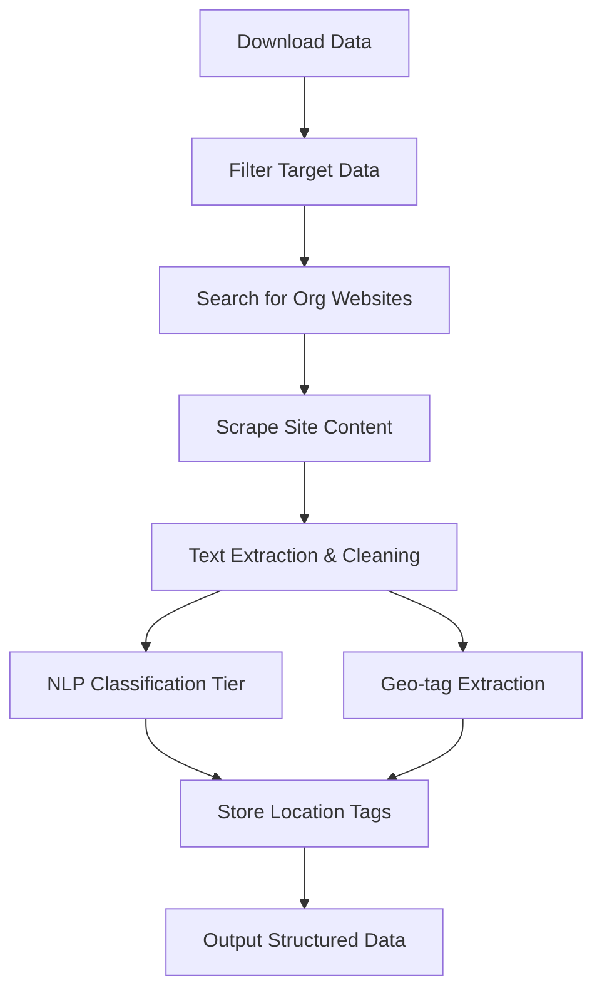
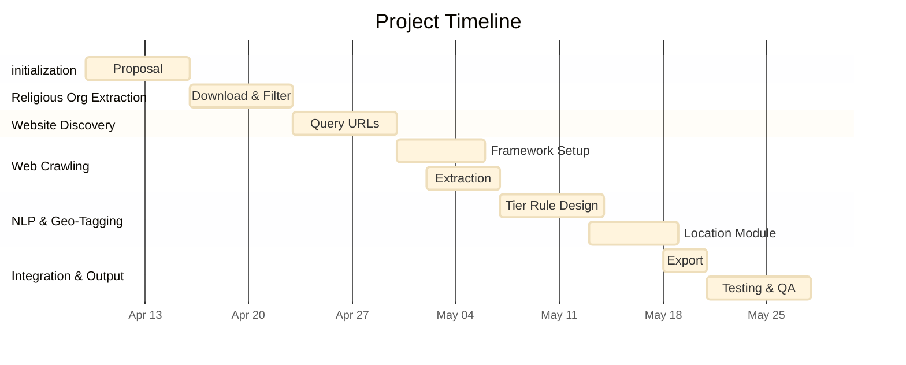

# Automated Discovery of Faith-Based K-12 Partnerships Using IRS Data and Targeted Web Crawling

## **Abstract**

This project proposes a scalable pipeline to identify and classify partnerships between faith-based organizations and K-12 schools across **13 Southern and Southeastern U.S. states, including DC**. By leveraging IRS exempt organization data, we will extract a filtered list of religious organizations whose headquarters are based in the following states: **Alabama, Arkansas, District of Columbia, Florida, Georgia, Kentucky, Louisiana, Mississippi, North Carolina, South Carolina, Tennessee, Virginia, and West Virginia**.

For each religious organization, we will use automated web search to locate their **official websites and social media accounts**, then crawl these sources for content related to **education partnerships**. We will also use automated queries to discover **counterpart K-12 schools**, when such partnerships are explicitly mentioned.

All educational project mentions will be extracted and categorized into three tiers: short-term material support, academic enrichment, and policy/advocacy. A structured “match table” linking **religious organization ↔ K-12 school ↔ project** will be generated, along with geographic tags to enable mapping and regional analysis. Final results will be stored in a centralized database and exported as CSV and SQLite formats for flexible use.

**Related Work**

The Association of Religion Data Archives (ARDA) provides religious demographic data but lacks partnership-level information.\
Existing nonprofit scraping pipelines—such as those used for IRS 990 analysis—rarely focus on faith-based organizations’ education involvement.\
Efforts to classify nonprofits using NTEE codes are helpful, but they don’t establish connections between institutions or project types, nor do they emphasize geographic filtering.

This project expands on prior approaches by:

* Restricting the analysis to a targeted set of 13 states
* Building a three-way mapping: **religious org ↔ school ↔ project**
* Collecting social media alongside website data
* Classifying activity type (Tier) and location

## **Technical Approach**

**1. Religious Organization Identification**

We begin by downloading the latest IRS Exempt Organizations Business Master File (BMF), covering all U.S. nonprofits. We filter to include only faith-based organizations headquartered in the following 13 target states:

> **Alabama, Arkansas, District of Columbia, Florida, Georgia, Kentucky, Louisiana, Mississippi, North Carolina, South Carolina, Tennessee, Virginia, and West Virginia**

Filtering logic includes:

* `NTEE_CD` begins with “X” (Religion-related)
* OR `CLASSIFICATION` includes “07” (Religious organization)
* OR `FILING_REQ_CD` is “06” or “13” (Church or religious entity exempt from filing)
* AND `STATE` matches one of the 13 listed

Each selected organization is matched to its official website and social media accounts using automated search.

**2. Education Institution Collection (K–12 School Data)**

We collect comprehensive K–12 public and private school data across the same 13 states using the **NCES Common Core of Data (CCD)**:

* Source: [https://nces.ed.gov/ccd/files.asp](https://nces.ed.gov/ccd/files.asp)
* Dataset: **Public School Universe Survey**
* Fields: School name, NCES ID, school type (public/private), district, location (city, state, ZIP), and website URL
* Filtering: Only retain schools located in the 13 target states

This dataset serves as the base for matching schools to faith-based partnerships.

**3. Domain & Social Media Identification**

* For each religious organization:
  * Query organization name using Bing Web Search API or SerpAPI
  * Identify the official homepage
  * Automatically extract and store links to verified **social media accounts**

**4. Web Crawling & Content Extraction**

* Use Scrapy or newspaper3k to crawl both official websites and linked social media pages
* Extract HTML text and public content for downstream analysis
* Normalize and deduplicate across multiple content sources

**5. Project Classification (Tier + Entity Matching + GeoTagging)**

* Use rule-based and NLP classification to assign education-related content into:
  * **Tier 1**: Short-term material service (e.g., school supply drives)
  * **Tier 2**: Academic support (e.g., tutoring, adult literacy)
  * **Tier 3**: Policy/advocacy (e.g., school funding, education justice)
* Use `spaCy` + `geopy` to extract:
  * Named schools, city/state locations, and organization names
* Create linkages between:
  * **Religious Org ↔ School ↔ Education Project**

**6. Structured Output and Storage**

* Output structured table:
  * Religious Org, School, Website, Social Media, Project Tier, Location, Snippet, Source
* Store in:
  * `faith_k12_partnerships.csv`
  * `partnerships.sqlite` database for querying and analysis

### **Technology Stack**

| Task                       | Tool/Library                        |
| -------------------------- | ----------------------------------- |
| Data Handling              | `pandas`, `csv`                     |
| Search & Website Discovery | `SerpAPI`, `Bing Search API`        |
| Web Crawling               | `Scrapy`, `newspaper3k`, `requests` |
| NLP Classification         | `spaCy`, `re`, `keyword rules`      |
| Geolocation Tagging        | `geopy`, `spaCy NER`                |
| Database & Storage         | `SQLite`, `pandas`, `csv`           |

### Timeline

## **Deliverables**

* A scalable, reproducible web scraping pipeline
* A Google Sheet of classified faith-based K-12 partnership activities

***

## Resources

**Code Repository:** [https://github.com/ChelseaLiu0822/Finding-Partnerships-Using-Web-Crawling](https://github.com/ChelseaLiu0822/Finding-Partnerships-Using-Web-Crawling)

**Data Sources:**

| Source                                        | Purpose                                     |
| --------------------------------------------- | ------------------------------------------- |
| **IRS Exempt Organizations BMF (eo1–eo4)**    | Religious organization filtering            |
| **NCES Common Core of Data (CCD)**            | Comprehensive K–12 school list              |
| **Bing Web Search API / SerpAPI**             | Discover official websites and social media |
| **Scrapy / newspaper3k**                      | Crawl and extract content from websites     |
| **spaCy, geopy**                              | Named entity recognition and geotagging     |
| **Public websites and verified social media** | Source of education partnership mentions    |

