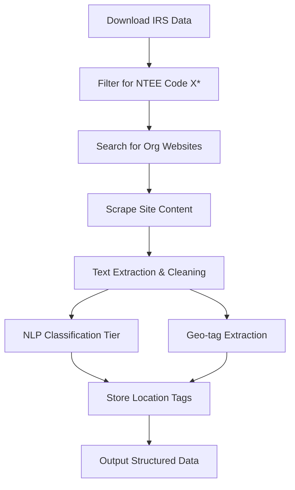
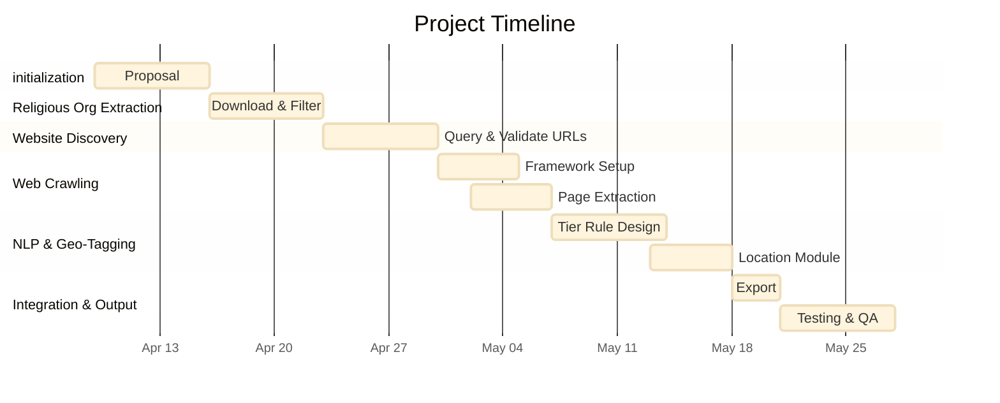

# Automated Discovery of Faith-Based K-12 Partnerships Using IRS Data and Targeted Web Crawling

## **Abstract**&#x20;

This project proposes a scalable pipeline to identify and classify partnerships between faith-based organizations and K-12 schools across the United States. By leveraging IRS exempt organization data, we will first extract a comprehensive list of religious organizations. Next, we use automated web search and scraping to locate their websites, extract textual content, and apply natural language processing (NLP) to categorize the nature of school-related partnerships into three defined tiers: short-term material support, academic enrichment, and policy/advocacy engagement. Additionally, all partnerships will be tagged with a geographic location to allow spatial analysis. Structured results will be stored in a centralized database and made available in CSV and SQLite formats.

**Related Work**

* The Association of Religion Data Archives (ARDA) has provided national-level demographic religious data, but not programmatic or partnership activity.
* Previous scraping pipelines (e.g., for nonprofit impact evaluation) have combined open IRS data with domain-specific NLP analysis but rarely targeted faith-based educational activity.
* Work on automated nonprofit classification using NTEE codes has been conducted but does not focus on relationship-level discovery or geographic disaggregation.

This project builds upon these foundations by creating an end-to-end domain-specific pipeline that captures, classifies, and geo-tags religious organizations’ educational outreach activities.

## **Technical Approach**

1. **Data Collection (IRS-based religious org identification)**
   * Download latest IRS Exempt Organizations BMF file.
   * Filter for NTEE codes beginning with "X" (e.g., X20: Christian, X30: Jewish, etc.) to isolate religious organizations.
2. **Domain Identification (Auto-search of websites)**
   * For each org name, query via Bing Web Search API or SerpAPI.
   * Scrape top result(s) and validate relevance via regex/org name matching.
3. **Web Crawling & Content Extraction**
   * Use Scrapy or newspaper3k to crawl selected domains.
   * Clean and extract main page text.
4. **Classification (Tier + Geo tagging)**
   * Apply keyword matching and NLP-based rule classification to assign:
     * Tier 1: Short-term material service (e.g., food drives, giveaways)
     * Tier 2: Academic programs (e.g., tutoring, literacy)
     * Tier 3: Policy/advocacy (e.g., funding equity, school reform)
   * Use spaCy + geopy to extract mentions of cities, states, or school district names.
5. **Structured Output and Storage**
   * Export structured result: org name, URL, partnership type (Tier), geographic tag, text snippet, source page.
   * Store in CSV and SQLite for querying, deduplication, and mapping.

### **Technology Stack**

| Task                       | Tool/Library                        |
| -------------------------- | ----------------------------------- |
| IRS Data Handling          | `pandas`, `csv`                     |
| Search & Website Discovery | `SerpAPI`, `Bing Search API`        |
| Web Crawling               | `Scrapy`, `newspaper3k`, `requests` |
| NLP Classification         | `spaCy`, `re`, `keyword rules`      |
| Geolocation Tagging        | `geopy`, `spaCy NER`                |
| Database & Storage         | `SQLite`, `pandas`, `csv`           |

### Timeline

## **Deliverables**

* A scalable, reproducible web scraping pipeline
* A structured CSV/SQLite database of classified faith-based K-12 partnership activities
* A geospatially tagged dataset ready for mapping or policy research
* Optional: an interactive dashboard (stretch goal)

***

## Data Source

* [IRS Exempt Organizations Business Master File](https://www.irs.gov/charities-non-profits/exempt-organizations-business-master-file-extract-eo-bmf)
* [ProPublica Nonprofit Explorer](https://projects.propublica.org/nonprofits/)
* [Charity Navigator](https://www.charitynavigator.org/)
* [Association of Religion Data Archives (ARDA)](https://www.thearda.com/)
* [Bing Web Search API](https://learn.microsoft.com/en-us/bing/search-apis/bing-web-search/overview)
* [SerpAPI](https://serpapi.com/)
* Public websites of religious organizations (.org, .edu domains)

